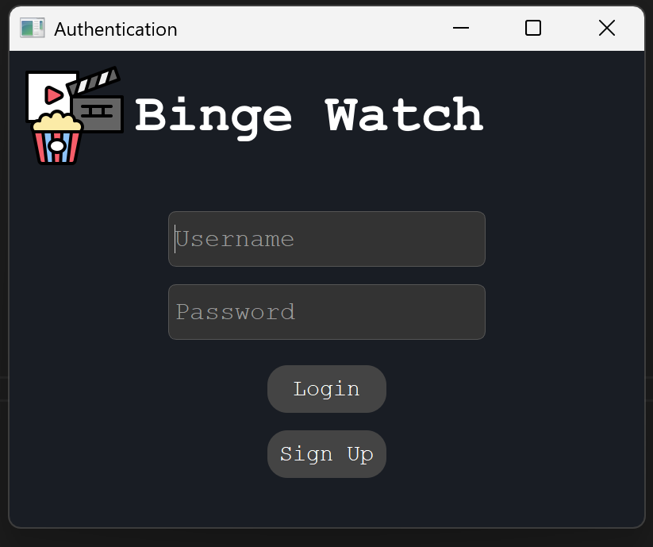
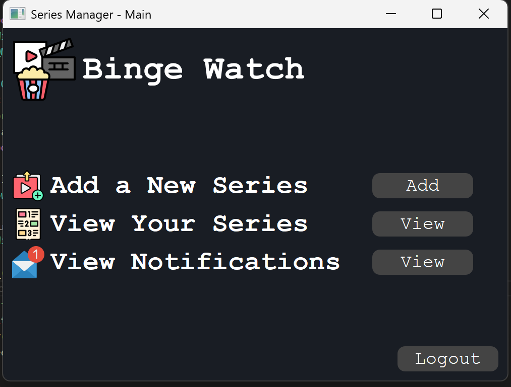
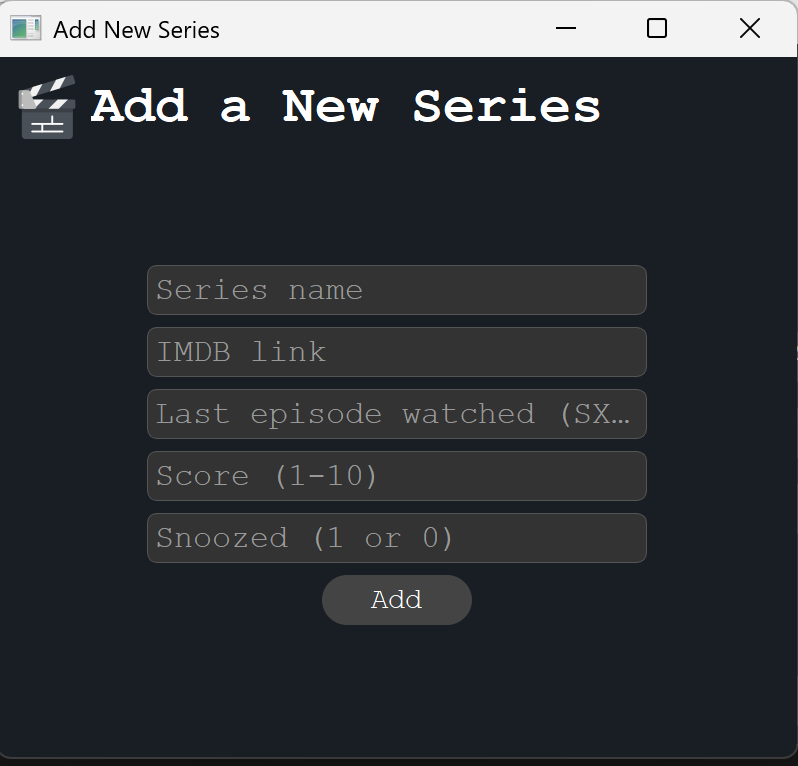
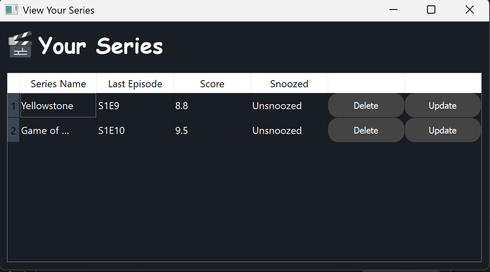
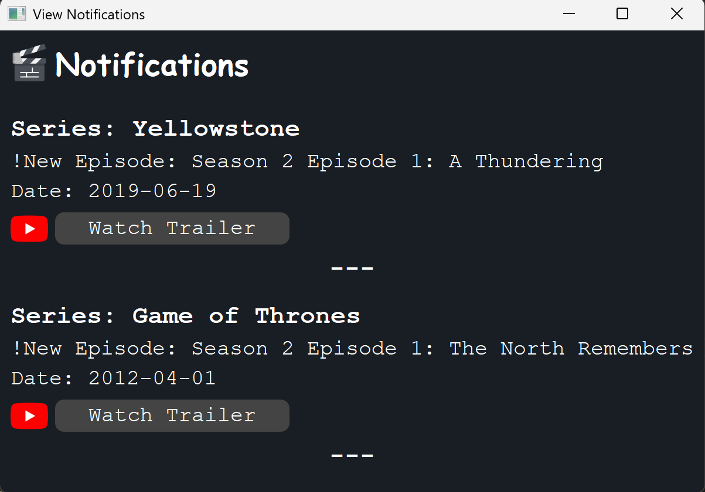

# **Project Python: Binge Watch**

## **1. User Authentication**

This section encompasses the login and signup processes, including all necessary validations:  
- Handling **incorrect username or password**.  
- Detecting **already existing accounts** during registration.  

---
## **2. Main Window**

### **Features**
1. **Add a New Episode**  
   Users can log a newly watched episode of a TV series.  

2. **View Personal Watchlist**  
   Users can access and manage their list of watched episodes and series.  

3. **Check Notifications**  
   Users can view upcoming episodes of the series in their watchlist.  
   - Includes a **YouTube trailer** for the next episode.
     
4. **Logout**
---

#  **3. Add Series Management**

This application allows users to add and manage their series collection, including the last watched episode, rating, and notification preferences. The data is validated, and the app integrates with the TMDB API to search and validate series details.

## Features
- **Add a Series**: Users can add series by providing the series name, IMDb link, last watched episode, rating and notification preferences.
- **IMDb Link Validation**: The IMDb link provided by the user is validated to ensure it follows the correct format. The link should be in the format `https://www.imdb.com/title/tt1234567/`, where `tt1234567` is the IMDb ID.
- **Episode Validation**: The last watched episode must follow the `SXEY` format (e.g., `S01E05` for Season 1, Episode 5).
- **Series and Episode Search**: The application uses the TMDB API to search for the series based on the IMDb link and validate the series name and episodes.
- **Rating**: Users can rate the series on a scale of 1 to 10.
- **Notification Preferences**: Users can choose to receive notifications for the series, with options for snoozing notifications.
- **Update Existing Series**: If a user adds an episode from an already existing series, they are prompted to choose whether to update the series list.

---

# **4. Viewing and Managing Your Series List**

The window for viewing your list contains a table displaying the episodes/series you've watched, along with their ratings and the snooze status (snoozed or unsnoozed). 

You have the following options:
- **Delete**: Remove a series or episode from your list.
- **Update**: Modify the rating or change the snooze status (whether snoozed or unsnoozed).

This provides a flexible way to manage your watched series and keep your list up to date.

---

## **5. Notification Window**

The Notification window only includes notifications for episodes that are **unsnoozed**, providing a list with the next episode to watch after the one that the user has marked as watched. If available, a YouTube trailer link for the episode is also provided.

This functionality is powered by the TMDB API, which is queried to fetch the necessary information through specific API routes, ensuring that the user receives accurate updates about upcoming episodes and related trailers.

